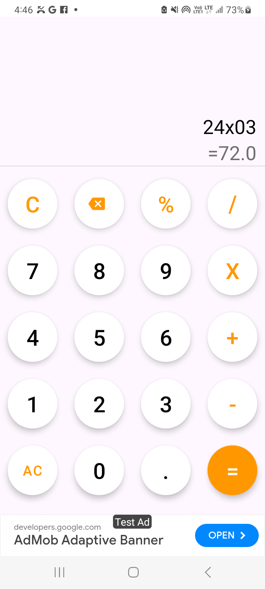

# SimpleCalculator

A basic Android calculator application that supports essential arithmetic operations. The app is designed to handle user input efficiently, evaluate mathematical expressions in real-time, and provide accurate results.

## Features

- **Basic Arithmetic Operations**: Supports addition, subtraction, multiplication, and division.
- **Real-Time Expression Evaluation**: The app calculates intermediate results as you type, providing instant feedback.
- **Error Handling**: Prevents and handles common errors like division by zero or invalid input gracefully.
- **AdMob Integration**: Includes banner ads via AdMob, configurable through the `Control` class.
- **Modern Android Practices**: Utilizes View Binding for efficient UI management and cleaner code.

## Screenshots




## Installation

To run the SimpleCalculator app, follow these steps:

1. Clone this repository:
    ```sh
    https://github.com/samyak2403/Calculator-App.git
    ```
2. Open the project in Android Studio.
3. Build the project and run it on an Android device or emulator.

## Usage

- **Digits and Operators**: Tap on the number buttons and operators (`+`, `-`, `x`, `/`) to enter expressions.
- **Equal (`=`)**: Press the `=` button to evaluate the expression and display the result.
- **All Clear (`AC`)**: Use the `AC` button to reset the calculator, clearing all input and results.
- **Backspace**: Tap the backspace button to remove the last entered digit or operator.
- **Clear (`C`)**: Use the `C` button to clear the current expression without resetting the entire calculator.

## Code Structure

- `MainActivity.kt`: The main activity that handles all user interactions and expression evaluations.
- `ActivityMainBinding`: View Binding class for accessing UI elements.
- `Control`: A class responsible for loading AdMob banner ads.

## Known Issues

- None reported.

## Contributing

Feel free to fork this repository, submit pull requests, or report issues. Contributions to improve the app are always welcome!

## License

This project is licensed under the MIT License - see the [LICENSE](LICENSE) file for details.

## Contact

Created by [Samyak Kamble](https://github.com/samyak2403) - feel free to contact me!

